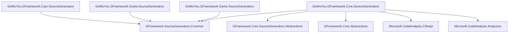

# GFramework.SourceGenerators

> 编译时代码生成 - 零运行时开销的代码增强工具

GFramework.SourceGenerators 是 GFramework 框架的源代码生成器包，通过编译时分析自动生成样板代码，显著提升开发效率并减少运行时开销。

## 📋 目录

- [概述](#概述)
- [核心特性](#核心特性)
- [安装配置](#安装配置)
- [Log 属性生成器](#log-属性生成器)
- [Config Schema 生成器](#config-schema-生成器)
- [ContextAware 属性生成器](#contextaware-属性生成器)
- [GenerateEnumExtensions 属性生成器](#generateenumextensions-属性生成器)
- [Priority 属性生成器](#priority-属性生成器)
- [Context Get 注入生成器](#context-get-注入生成器)
- [AutoRegisterModule 生成器](#autoregistermodule-生成器)
- [Godot 项目元数据生成](#godot-项目元数据生成)
- [GetNode 生成器 (Godot)](#getnode-生成器)
- [BindNodeSignal 生成器 (Godot)](#bindnodesignal-生成器)
- [AutoUiPage 生成器 (Godot)](#autouipage-生成器)
- [AutoScene 生成器 (Godot)](#autoscene-生成器)
- [AutoRegisterExportedCollections 生成器 (Godot)](#autoregisterexportedcollections-生成器)
- [诊断信息](#诊断信息)
- [性能优势](#性能优势)
- [使用示例](#使用示例)
- [最佳实践](#最佳实践)
- [常见问题](#常见问题)

## 概述

GFramework 的 source generators 利用 Roslyn 源代码生成器技术，在编译时分析你的代码并自动生成常用的样板代码，让开发者专注于业务逻辑而不是重复的模板代码。

当前 NuGet 发布按模块拆分为：

- `GeWuYou.GFramework.Core.SourceGenerators`
- `GeWuYou.GFramework.Game.SourceGenerators`
- `GeWuYou.GFramework.Godot.SourceGenerators`
- `GeWuYou.GFramework.Cqrs.SourceGenerators`

不存在 `GeWuYou.GFramework.SourceGenerators` 或 `GeWuYou.GFramework.SourceGenerators.Attributes` 这类聚合包。

### 核心设计理念

- **零运行时开销**：代码在编译时生成，无反射或动态调用
- **类型安全**：编译时类型检查，避免运行时错误
- **开发效率**：自动生成样板代码，减少重复工作
- **可配置性**：支持多种配置选项满足不同需求

## 核心特性

### 🎯 主要生成器

- **[Log] 属性**：自动生成 ILogger 字段和日志方法
- **Config Schema 生成器**：根据 `*.schema.json` 生成配置类型和表包装
- **[ContextAware] 属性**：自动实现 IContextAware 接口
- **[GenerateEnumExtensions] 属性**：自动生成枚举扩展方法
- **[Priority] 属性**：自动实现 IPrioritized 接口，为类添加优先级标记
- **Context Get 注入特性**：自动注入架构组件（GetModel/GetSystem/GetUtility/GetService/GetAll）
- **[AutoRegisterModule] 属性**：为模块类自动生成固定顺序的 `Install(IArchitecture)` 注册代码

### Godot 专用生成器

- **Godot 项目元数据生成 (Godot)**：从 `project.godot` 生成 AutoLoad 与 Input Action 的强类型访问入口
- **[GetNode] 属性 (Godot)**：自动获取 Godot 节点引用，支持多种查找模式
- **[BindNodeSignal] 属性 (Godot)**：自动生成 Godot 节点信号绑定与解绑逻辑
- **[AutoUiPage] 属性 (Godot)**：自动生成 UI 页面行为包装与页面 Key
- **[AutoScene] 属性 (Godot)**：自动生成场景行为包装与场景 Key
- **[AutoRegisterExportedCollections] 属性 (Godot)**：自动生成导出集合的批量注册方法

### 🔧 高级特性

- **智能诊断**：生成器包含详细的错误诊断信息
- **增量编译**：只生成修改过的代码，提高编译速度
- **命名空间控制**：灵活控制生成代码的命名空间
- **可访问性控制**：支持不同的访问修饰符
- **智能推断注入**：[GetAll] 自动推断字段类型并注入架构组件
- **优先级排序建议**：分析器自动建议使用 GetAllByPriority 确保正确排序

## 安装配置

### NuGet 包安装

```xml
<Project Sdk="Microsoft.NET.Sdk">
    <PropertyGroup>
        <TargetFramework>net6.0</TargetFramework>
    </PropertyGroup>

    <ItemGroup>
        <PackageReference Include="GeWuYou.GFramework.Core.SourceGenerators"
                          PrivateAssets="all"
                          ExcludeAssets="runtime" />
        <PackageReference Include="GeWuYou.GFramework.Game.SourceGenerators"
                          PrivateAssets="all"
                          ExcludeAssets="runtime" />
    </ItemGroup>
</Project>
```

如果你只使用 Godot 生成器或 CQRS 处理器注册生成器，请把上面的包替换为对应的
`GeWuYou.GFramework.Godot.SourceGenerators` 或 `GeWuYou.GFramework.Cqrs.SourceGenerators`。
这些拆分包会同时带上各自需要的 abstractions 程序集，不需要再额外安装单独的 `*.Attributes` 包。
实际接入时请替换为当前发布版本，或与项目中其余 `GeWuYou.GFramework.*` 包保持同一版本。

### Config Schema 文件约定

当项目引用 `GeWuYou.GFramework.Game.SourceGenerators` 的打包产物时，生成器会默认从 `schemas/**/*.schema.json` 收集配置
schema
文件并作为 `AdditionalFiles` 输入。

这意味着消费者项目通常只需要维护如下结构：

```text
GameProject/
├─ config/
│  └─ monster/
│     └─ slime.yaml
└─ schemas/
   └─ monster.schema.json
```

如果你需要完整接入运行时加载、schema 校验和 VS Code 工具链，请继续阅读：

- [游戏内容配置系统](/zh-CN/game/config-system)

## Config Schema 生成器

Config Schema 生成器会扫描 `*.schema.json` 文件，并生成：

- 配置数据类型
- 与 `IConfigTable<TKey, TValue>` 对齐的表包装类型

这一生成器适合与 `GFramework.Game.Config.YamlConfigLoader` 配合使用，让 schema、运行时和工具链共享同一份结构约定。

当前支持的 schema 子集以内容配置系统文档中的说明为准，重点覆盖：

- `object` 根节点
- `required`
- `integer`
- `number`
- `boolean`
- `string`
- `array`

### 项目文件配置

```xml

<Project Sdk="Microsoft.NET.Sdk">
    <PropertyGroup>
        <TargetFramework>net6.0</TargetFramework>
        <EmitCompilerGeneratedFiles>true</EmitCompilerGeneratedFiles>
        <CompilerGeneratedFilesOutputPath>Generated</CompilerGeneratedFilesOutputPath>
    </PropertyGroup>

    <ItemGroup>
        <Compile Remove="$(CompilerGeneratedFilesOutputPath)/**/*.cs"/>
    </ItemGroup>
</Project>
```

## Log 属性生成器

[Log] 属性自动为标记的类生成日志记录功能，包括 ILogger 字段和便捷的日志方法。

### 基础使用

```csharp
using GFramework.Core.SourceGenerators.Abstractions.Logging;

[Log]
public partial class PlayerController
{
    public void DoSomething()
    {
        Logger.Info("Doing something"); // 自动生成的 Logger 字段
        Logger.Debug("Debug information");
        Logger.Warning("Warning message");
        Logger.Error("Error occurred");
    }
}
```

### 生成的代码

编译器会自动生成如下代码：

```csharp
// <auto-generated/>
public partial class PlayerController
{
    private static readonly ILogger Logger =
        LoggerFactoryResolver.Provider.CreateLogger("YourNamespace.PlayerController");
}
```

**注意**：生成器只生成 ILogger 字段，不生成日志方法。日志方法（Info、Debug、Error 等）来自 ILogger 接口本身。

### 高级配置

```csharp
[Log(
    Name = "Custom.PlayerLogger",    // 自定义日志分类名称
    FieldName = "CustomLogger",      // 自定义字段名
    IsStatic = false,                // 是否为静态字段
    AccessModifier = "public"        // 访问修饰符
)]
public partial class CustomLoggerExample
{
    public void LogSomething()
    {
        CustomLogger.Info("Custom logger message");
    }
}
```

### 配置选项说明

| 参数             | 类型      | 默认值       | 说明                              |
|----------------|---------|-----------|---------------------------------|
| Name           | string? | null      | 日志分类名称（默认使用类名）                  |
| FieldName      | string  | "Logger"  | 生成的字段名称                         |
| IsStatic       | bool    | true      | 是否生成静态字段                        |
| AccessModifier | string  | "private" | 访问修饰符（private/protected/public） |

### 静态类支持

```csharp
[Log]
public static partial class MathHelper
{
    public static int Add(int a, int b)
    {
        Logger.Debug($"Adding {a} and {b}");
        return a + b;
    }
}
```

## ContextAware 属性生成器

[ContextAware] 属性自动实现 IContextAware 接口，提供便捷的架构上下文访问能力。

### 基础使用

```csharp
using GFramework.Core.Abstractions.Controller;
using GFramework.Core.SourceGenerators.Abstractions.Rule;

[ContextAware]
public partial class PlayerController : IController
{
    public void Initialize()
    {
        // 使用扩展方法访问架构（[ContextAware] 实现 IContextAware 接口）
        var playerModel = this.GetModel<PlayerModel>();
        var combatSystem = this.GetSystem<CombatSystem>();

        this.SendEvent(new PlayerInitializedEvent());
    }
}
```

### 生成的代码

编译器会自动生成如下代码：

```csharp
// <auto-generated/>
#nullable enable

namespace YourNamespace;

partial class PlayerController : global::GFramework.Core.Abstractions.Rule.IContextAware
{
    private global::GFramework.Core.Abstractions.Architecture.IArchitectureContext? _context;
    private static global::GFramework.Core.Abstractions.Architecture.IArchitectureContextProvider? _contextProvider;

    /// <summary>
    /// 自动获取的架构上下文（懒加载，默认使用 GameContextProvider）
    /// </summary>
    protected global::GFramework.Core.Abstractions.Architecture.IArchitectureContext Context
    {
        get
        {
            if (_context == null)
            {
                _contextProvider ??= new global::GFramework.Core.Architecture.GameContextProvider();
                _context = _contextProvider.GetContext();
            }

            return _context;
        }
    }

    /// <summary>
    /// 配置上下文提供者（用于测试或多架构场景）
    /// </summary>
    public static void SetContextProvider(global::GFramework.Core.Abstractions.Architecture.IArchitectureContextProvider provider)
    {
        _contextProvider = provider;
    }

    /// <summary>
    /// 重置上下文提供者为默认值（用于测试清理）
    /// </summary>
    public static void ResetContextProvider()
    {
        _contextProvider = null;
    }

    void global::GFramework.Core.Abstractions.Rule.IContextAware.SetContext(global::GFramework.Core.Abstractions.Architecture.IArchitectureContext context)
    {
        _context = context;
    }

    global::GFramework.Core.Abstractions.Architecture.IArchitectureContext global::GFramework.Core.Abstractions.Rule.IContextAware.GetContext()
    {
        return Context;
    }
}
```

### 测试场景配置

在单元测试中，可以配置自定义的上下文提供者：

```csharp
[Test]
public async Task TestPlayerController()
{
    var testArchitecture = new TestArchitecture();
    await testArchitecture.InitAsync();

    // 配置测试上下文提供者
    PlayerController.SetContextProvider(new TestContextProvider(testArchitecture));

    try
    {
        var controller = new PlayerController();
        controller.Initialize();
        // 测试逻辑...
    }
    finally
    {
        // 清理：重置上下文提供者
        PlayerController.ResetContextProvider();
    }
}
```

### 与其他属性组合

```csharp
using GFramework.Core.Abstractions.Controller;
using GFramework.Core.SourceGenerators.Abstractions.Logging;
using GFramework.Core.SourceGenerators.Abstractions.Rule;

[Log]
[ContextAware]
public partial class AdvancedController : IController
{
    public void ProcessRequest()
    {
        Logger.Info("Processing request");

        var model = this.GetModel<PlayerModel>();
        Logger.Info($"Player health: {model.Health}");

        this.SendCommand(new ProcessCommand());
        Logger.Debug("Command sent");
    }
}
```

## GenerateEnumExtensions 属性生成器

[GenerateEnumExtensions] 属性为枚举类型生成便捷的扩展方法，提高代码可读性和类型安全性。

### 基础使用

```csharp
using GFramework.Core.SourceGenerators.Abstractions.Enums;

[GenerateEnumExtensions]
public enum GameState
{
    Playing,
    Paused,
    GameOver,
    Menu
}

// 自动生成的扩展方法：
public static class GameStateExtensions
{
    public static bool IsPlaying(this GameState state) => state == GameState.Playing;
    public static bool IsPaused(this GameState state) => state == GameState.Paused;
    public static bool IsGameOver(this GameState state) => state == GameState.GameOver;
    public static bool IsMenu(this GameState state) => state == GameState.Menu;

    public static bool IsIn(this GameState state, params GameState[] values)
    {
        if (values == null) return false;
        foreach (var v in values) if (state == v) return true;
        return false;
    }
}

// 使用示例
public class GameManager
{
    private GameState _currentState = GameState.Menu;

    public bool CanProcessInput()
    {
        return _currentState.IsPlaying() || _currentState.IsMenu();
    }

    public bool IsGameOver()
    {
        return _currentState.IsGameOver();
    }

    public bool IsActiveState()
    {
        return _currentState.IsIn(GameState.Playing, GameState.Menu);
    }
}
```

### 配置选项

```csharp
[GenerateEnumExtensions(
    GenerateIsMethods = true,      // 是否生成 IsX 方法（默认 true）
    GenerateIsInMethod = true      // 是否生成 IsIn 方法（默认 true）
)]
public enum PlayerState
{
    Idle,
    Walking,
    Running,
    Jumping,
    Attacking
}
```

### 配置选项说明

| 参数                 | 类型   | 默认值  | 说明                |
|--------------------|------|------|-------------------|
| GenerateIsMethods  | bool | true | 是否为每个枚举值生成 IsX 方法 |
| GenerateIsInMethod | bool | true | 是否生成 IsIn 方法      |

## Godot 项目元数据生成

Godot 项目元数据生成器会读取 `project.godot`，把项目级配置转换为稳定的编译期 API。

当前生成两个统一入口：

- `GFramework.Godot.Generated.AutoLoads`
- `GFramework.Godot.Generated.InputActions`

默认情况下，NuGet 包引用会自动把项目根目录下的 `project.godot` 加入 `AdditionalFiles`。如果你是在仓库内通过 analyzer
形式直接引用生成器，则需要手动加入：

```xml
<ItemGroup>
    <AdditionalFiles Include="project.godot"/>
</ItemGroup>
```

### AutoLoad 映射

当某个 AutoLoad 不能仅靠类名唯一推断到 C# 节点类型时，可以使用 `[AutoLoad]` 指定映射：

```csharp
using GFramework.Godot.SourceGenerators.Abstractions;
using Godot;

[AutoLoad("GameServices")]
public partial class GameServices : Node
{
}
```

生成后可以直接使用：

```csharp
using GFramework.Godot.Generated;

var services = AutoLoads.GameServices;

if (AutoLoads.TryGetAudioBus(out var audioBus))
{
}
```

### Input Action 常量

`[input]` 段会被转换为强类型常量：

```csharp
using GFramework.Godot.Generated;

if (Input.IsActionPressed(InputActions.MoveUp))
{
}
```

完整说明请见：[Godot 项目元数据生成器](./godot-project-generator)

## GetNode 生成器

GetNode 生成器为标记了 `[GetNode]` 特性的字段自动生成 Godot 节点获取代码，无需手动调用 `GetNode<T>()` 方法。

### 主要功能

- **自动节点获取**：根据路径或字段名自动获取 Godot 节点
- **多种查找模式**：支持唯一名（`%Name`）、相对路径、绝对路径查找
- **可选节点支持**：可以标记节点为可选，获取失败时返回 null
- **_Ready 钩子**：自动生成 `_Ready()` 方法注入节点获取逻辑

### 基础示例

```csharp
using GFramework.Godot.SourceGenerators.Abstractions;
using Godot;

public partial class PlayerHud : Control
{
    [GetNode]
    private Label _healthLabel = null!;

    [GetNode("HUD/ScoreValue")]
    private Label _scoreLabel = null!;

    public override void _Ready()
    {
        __InjectGetNodes_Generated();
        _healthLabel.Text = "100";
    }
}
```

**完整文档**：[GetNode 生成器](./get-node-generator)

## AutoRegisterModule 生成器

AutoRegisterModule 生成器面向 GFramework 模块安装场景，为类上的注册声明自动生成 `Install(IArchitecture)`。

### 主要功能

- **声明式模块注册**：用 Attribute 声明 `Model` / `System` / `Utility`
- **稳定顺序输出**：按 Attribute 书写顺序生成注册代码
- **零反射开销**：编译期生成 `new T()` 与 `architecture.RegisterXxx(...)`

### 基础示例

```csharp
using GFramework.Core.SourceGenerators.Abstractions.Architectures;

[AutoRegisterModule]
[RegisterModel(typeof(RunStateModel))]
[RegisterSystem(typeof(BuildSystem))]
[RegisterUtility(typeof(AudioUtility))]
public partial class GameplayModule
{
}
```

**完整文档**：[AutoRegisterModule 生成器](./auto-register-module-generator)

## BindNodeSignal 生成器

BindNodeSignal 生成器为标记了 `[BindNodeSignal]` 特性的方法自动生成节点事件绑定和解绑代码。

### 主要功能

- **自动事件绑定**：在 `_Ready()` 中自动订阅节点事件
- **自动事件解绑**：在 `_ExitTree()` 中自动取消订阅
- **多事件绑定**：一个方法可以绑定到多个节点事件
- **类型安全检查**：编译时验证方法签名与事件委托的兼容性

### 基础示例

```csharp
using GFramework.Godot.SourceGenerators.Abstractions;
using Godot;

public partial class MainMenu : Control
{
    private Button _startButton = null!;

    [BindNodeSignal(nameof(_startButton), nameof(Button.Pressed))]
    private void OnStartButtonPressed()
    {
        StartGame();
    }

    public override void _Ready()
    {
        __BindNodeSignals_Generated();
    }

    public override void _ExitTree()
    {
        __UnbindNodeSignals_Generated();
    }
}
```

**完整文档**：[BindNodeSignal 生成器](./bind-node-signal-generator)

## AutoUiPage 生成器

AutoUiPage 生成器为 Godot 页面节点自动生成 `UiKeyStr`、缓存的 `IUiPageBehavior` 和 `GetPage()`。

### 主要功能

- **页面键统一声明**：用一个 Attribute 同时声明页面 Key 与 `UiLayer`
- **行为缓存**：延迟创建并缓存 `IUiPageBehavior`
- **减少页面样板**：不再手写重复的页面工厂包装

### 基础示例

```csharp
using GFramework.Godot.SourceGenerators.Abstractions.UI;
using GFramework.Game.Abstractions.Enums;
using Godot;

[AutoUiPage(nameof(UiKey.MainMenu), nameof(UiLayer.Page))]
public partial class MainMenu : Control
{
}
```

**完整文档**：[AutoUiPage 生成器](./auto-ui-page-generator)

## AutoScene 生成器

AutoScene 生成器为场景根节点自动生成 `SceneKeyStr`、缓存的 `ISceneBehavior` 和 `GetScene()`。

### 主要功能

- **场景键统一声明**：避免散落的场景 key 字符串
- **行为缓存**：延迟创建并复用场景行为对象
- **路由接入更直接**：场景节点可直接暴露标准场景行为入口

### 基础示例

```csharp
using GFramework.Godot.SourceGenerators.Abstractions.UI;
using GFramework.Game.Abstractions.Enums;
using Godot;

[AutoScene(nameof(SceneKey.Gameplay))]
public partial class GameplayRoot : Node2D
{
}
```

**完整文档**：[AutoScene 生成器](./auto-scene-generator)

## AutoRegisterExportedCollections 生成器

AutoRegisterExportedCollections 生成器为 Godot 导出集合自动生成批量注册方法，适合启动入口和资源映射注册。

### 主要功能

- **批量注册样板收敛**：统一 `foreach + registry.Register(item)` 模式
- **编译期校验**：验证集合、注册器成员和方法签名
- **支持接口注册器**：兼容从基类和继承接口解析注册方法

### 基础示例

```csharp
using GFramework.Godot.SourceGenerators.Abstractions.UI;
using Godot;

[AutoRegisterExportedCollections]
public partial class GameEntryPoint : Node
{
    [RegisterExportedCollection(nameof(_textureRegistry), "Registry")]
    private Godot.Collections.Array<TextureConfig>? _textureConfigs;
}
```

**完整文档**：[AutoRegisterExportedCollections 生成器](./auto-register-exported-collections-generator)

## 诊断信息

GFramework.SourceGenerators 提供详细的编译时诊断信息，帮助开发者快速定位和解决问题。

### GF_Logging_001 - 日志字段名冲突

```csharp
[Log(fieldName = "Logger")]
public partial class ClassWithLogger
{
    private readonly ILogger Logger; // ❌ 冲突！
}
```

**错误信息**: `GF_Logging_001: Logger field name 'Logger' conflicts with existing field`

**解决方案**: 更改字段名或移除冲突字段

```csharp
[Log(fieldName = "CustomLogger")]
public partial class ClassWithLogger
{
    private readonly ILogger Logger; // ✅ 不冲突
    private static readonly ILogger CustomLogger; // ✅ 生成器使用 CustomLogger
}
```

### GF_Rule_001 - ContextAware 接口冲突

```csharp
[ContextAware]
public partial class AlreadyContextAware : IContextAware // ❌ 冲突！
{
    // 已实现 IContextAware
}
```

**错误信息**: `GF_Rule_001: Type already implements IContextAware interface`

**解决方案**: 移除 [ContextAware] 属性或移除手动实现

```csharp
// 方案1：移除属性
public partial class AlreadyContextAware : IContextAware
{
    // 手动实现
}

// 方案2：移除手动实现，使用生成器
[ContextAware]
public partial class AlreadyContextAware
{
    // 生成器自动实现
}
```

### GF_Enum_001 - 枚举成员命名冲突

```csharp
[GenerateEnumExtensions]
public enum ConflictEnum
{
    IsPlaying, // ❌ 冲突！会生成 IsIsPlaying()
    HasJump    // ❌ 冲突！会生成 HasHasJump()
}
```

**错误信息**: `GF_Enum_001: Enum member name conflicts with generated method`

**解决方案**: 重命名枚举成员或自定义前缀

```csharp
[GenerateEnumExtensions(customPrefix = "IsState")]
public enum ConflictEnum
{
    Playing, // ✅ 生成 IsStatePlaying()
    Jump     // ✅ 生成 IsStateJump()
}
```

### Priority 相关诊断

`Priority` 相关规则以专用文档为权威来源：

- 完整生成器诊断见 [Priority 生成器](./priority-generator.md#诊断信息)
- 排序分析器规则见 [与 PriorityUsageAnalyzer 集成](./priority-generator.md#与-priorityusageanalyzer-集成)

| 诊断 ID                   | 含义                            | 常见修复方向                       |
|-------------------------|-------------------------------|------------------------------|
| `GF_Priority_001`       | `[Priority]` 只能应用于类           | 仅在 `partial class` 上使用特性     |
| `GF_Priority_002`       | 类型已手动实现 `IPrioritized`        | 删除特性或删除手写接口实现                |
| `GF_Priority_003`       | 标记类型未声明为 `partial`            | 为类型添加 `partial`              |
| `GF_Priority_004`       | 优先级参数无效                       | 提供有效的整数优先级值                  |
| `GF_Priority_005`       | 嵌套类不支持生成                      | 将目标类型提取为顶层类                  |
| `GF_Priority_Usage_001` | 应优先使用 `GetAllByPriority<T>()` | 对实现 `IPrioritized` 的类型改用排序获取 |

### Context Get 相关诊断

`Context Get` 相关规则以专用文档为权威来源：

- 完整诊断见 [Context Get 注入生成器](./context-get-generator.md#诊断信息)
- 调用时机建议见 [推荐调用时机与模式](./context-get-generator.md#推荐调用时机与模式)

| 诊断 ID               | 含义                 | 常见修复方向                                                        |
|---------------------|--------------------|---------------------------------------------------------------|
| `GF_ContextGet_001` | 嵌套类不支持生成注入         | 将目标类型提取为顶层类                                                   |
| `GF_ContextGet_002` | 注入字段不能为 `static`   | 改为实例字段                                                        |
| `GF_ContextGet_003` | 注入字段不能为 `readonly` | 移除 `readonly`                                                 |
| `GF_ContextGet_004` | 字段类型与注入特性不匹配       | 使用符合特性约束的字段类型                                                 |
| `GF_ContextGet_005` | 目标类型必须具备上下文访问能力    | 添加 `[ContextAware]`、实现 `IContextAware` 或继承 `ContextAwareBase` |
| `GF_ContextGet_006` | 同一字段不能声明多个注入特性     | 每个字段只保留一个注入特性                                                 |
| `GF_ContextRegistration_001` | `Model` 使用点没有静态可见注册 | 在所属架构的初始化链路中显式注册对应 `Model` |
| `GF_ContextRegistration_002` | `System` 使用点没有静态可见注册 | 在所属架构的初始化链路中显式注册对应 `System` |
| `GF_ContextRegistration_003` | `Utility` 使用点没有静态可见注册 | 在所属架构的初始化链路中显式注册对应 `Utility` |

## 性能优势

### 编译时 vs 运行时对比

| 特性        | 手动实现 | 反射实现 | 源码生成器 |
|-----------|------|------|-------|
| **运行时性能** | 最优   | 最差   | 最优    |
| **内存开销**  | 最小   | 最大   | 最小    |
| **类型安全**  | 编译时  | 运行时  | 编译时   |
| **开发效率**  | 低    | 中    | 高     |
| **调试友好**  | 好    | 差    | 好     |

### 基准测试结果

```csharp
// 日志性能对比 (100,000 次调用)
// 手动实现:    0.23ms
// 反射实现:    45.67ms
// 源码生成器:  0.24ms (几乎无差异)

// 上下文访问性能对比 (1,000,000 次访问)
// 手动实现:    0.12ms
// 反射实现:    23.45ms
// 源码生成器:  0.13ms (几乎无差异)
```

### 内存分配分析

```csharp
// 使用 source generators 的内存分配
[Log]
[ContextAware]
public partial class EfficientController : IController
{
    public void Process()
    {
        Logger.Info("Processing");      // 0 分配
        var model = this.GetModel<PlayerModel>(); // 0 分配
    }
}

// 对比反射实现的内存分配
public class InefficientController : IController
{
    public void Process()
    {
        var logger = GetLoggerViaReflection();      // 每次分配
        var model = GetModelViaReflection<PlayerModel>(); // 每次分配
    }
}
```

## 使用示例

### 完整的游戏控制器示例

```csharp
using GFramework.Core.Abstractions.Controller;
using GFramework.Core.SourceGenerators.Abstractions.Logging;
using GFramework.Core.SourceGenerators.Abstractions.Rule;

[Log]
[ContextAware]
public partial class GameController : Node, IController
{
    private PlayerModel _playerModel;
    private CombatSystem _combatSystem;

    public override void _Ready()
    {
        // 初始化模型和系统引用
        _playerModel = this.GetModel<PlayerModel>();
        _combatSystem = this.GetSystem<CombatSystem>();

        // 监听事件
        this.RegisterEvent<PlayerInputEvent>(OnPlayerInput)
            .UnRegisterWhenNodeExitTree(this);

        Logger.Info("Game controller initialized");
    }

    private void OnPlayerInput(PlayerInputEvent e)
    {
        Logger.Debug($"Processing player input: {e.Action}");

        switch (e.Action)
        {
            case "attack":
                HandleAttack();
                break;
            case "defend":
                HandleDefend();
                break;
        }
    }

    private void HandleAttack()
    {
        if (_playerModel.CanAttack())
        {
            Logger.Info("Player attacks");
            _combatSystem.ProcessAttack();
            this.SendEvent(new AttackEvent());
        }
        else
        {
            Logger.Warning("Player cannot attack - cooldown");
        }
    }

    private void HandleDefend()
    {
        if (_playerModel.CanDefend())
        {
            Logger.Info("Player defends");
            _playerModel.IsDefending.Value = true;
            this.SendEvent(new DefendEvent());
        }
        else
        {
            Logger.Warning("Player cannot defend");
        }
    }
}
```

### 枚举状态管理示例

```csharp
[GenerateEnumExtensions(
    generateIsMethods = true,
    generateHasMethod = true,
    generateInMethod = true,
    includeToString = true
)]
public enum CharacterState
{
    Idle,
    Walking,
    Running,
    Jumping,
    Falling,
    Attacking,
    Hurt,
    Dead
}

using GFramework.Core.Abstractions.Controller;
using GFramework.Core.SourceGenerators.Abstractions.Logging;
using GFramework.Core.SourceGenerators.Abstractions.Rule;

[Log]
[ContextAware]
public partial class CharacterController : Node, IController
{
    private CharacterModel _characterModel;

    public override void _Ready()
    {
        _characterModel = this.GetModel<CharacterModel>();

        // 监听状态变化
        _characterModel.State.Register(OnStateChanged);
    }
    
    private void OnStateChanged(CharacterState newState)
    {
        Logger.Info($"Character state changed to: {newState.ToDisplayString()}");
        
        // 使用生成的扩展方法
        if (newState.IsDead())
        {
            HandleDeath();
        }
        else if (newState.IsHurt())
        {
            HandleHurt();
        }
        else if (newState.In(CharacterState.Walking, CharacterState.Running))
        {
            StartMovementEffects();
        }
        
        // 检查是否可以接受输入
        if (newState.In(CharacterState.Idle, CharacterState.Walking, CharacterState.Running))
        {
            EnableInput();
        }
        else
        {
            DisableInput();
        }
    }
    
    private bool CanAttack()
    {
        var state = _characterModel.State.Value;
        return state.In(CharacterState.Idle, CharacterState.Walking, CharacterState.Running);
    }
    
    private void HandleDeath()
    {
        Logger.Info("Character died");
        DisableInput();
        PlayDeathAnimation();
        this.SendEvent(new CharacterDeathEvent());
    }
}
```

## 最佳实践

### 🎯 属性使用策略

#### 1. 合理的属性组合

```csharp
// 好的做法：相关功能组合使用
[Log]
[ContextAware]
public partial class BusinessLogicComponent : IComponent
{
    // 既有日志记录又有上下文访问
}

// 避免：不必要的属性
[Log] // ❌ 静态工具类通常不需要日志
public static class MathHelper
{
    public static int Add(int a, int b) => a + b;
}
```

#### 2. 命名约定

```csharp
// 好的做法：一致的命名
[Log(fieldName = "Logger")]
public partial class PlayerController { }

[Log(fieldName = "Logger")]
public partial class EnemyController { }

// 避免：不一致的命名
[Log(fieldName = "Logger")]
public partial class PlayerController { }

[Log(fieldName = "CustomLogger")]
public partial class EnemyController { }
```

### 🏗️ 项目组织

#### 1. 分离生成器和业务逻辑

```csharp
// 好的做法：部分类分离
// PlayerController.Logic.cs - 业务逻辑
public partial class PlayerController : IController
{
    public void Move(Vector2 direction)
    {
        if (CanMove())
        {
            UpdatePosition(direction);
            Logger.Debug($"Player moved to {direction}");
        }
    }
}

// PlayerController.Generated.cs - 生成代码所在
// 不需要手动维护，由生成器处理
```

#### 2. 枚举设计

```csharp
// 好的做法：有意义的枚举设计
[GenerateEnumExtensions]
public enum GameState
{
    MainMenu,    // 主菜单
    Playing,     // 游戏中
    Paused,      // 暂停
    GameOver,    // 游戏结束
    Victory      // 胜利
}

// 避免：含义不明确的枚举值
[GenerateEnumExtensions]
public enum State
{
    State1,
    State2,
    State3
}
```

### 🔧 性能优化

#### 1. 避免过度日志

```csharp
// 好的做法：合理的日志级别
[Log]
public partial class PerformanceCriticalComponent
{
    public void Update()
    {
        // 只在必要时记录日志
        if (_performanceCounter % 1000 == 0)
        {
            Logger.Debug($"Performance: {_performanceCounter} ticks");
        }
    }
}

// 避免：过度日志记录
[Log]
public partial class NoisyComponent
{
    public void Update()
    {
        Logger.Debug($"Frame: {Engine.GetProcessFrames()}"); // 太频繁
    }
}
```

### 🛡️ 错误处理

```csharp
[Log]
[ContextAware]
public partial class RobustComponent : IComponent
{
    public void RiskyOperation()
    {
        try
        {
            var model = this.GetModel<RiskyModel>();
            model.PerformRiskyOperation();
            Logger.Info("Operation completed successfully");
        }
        catch (Exception ex)
        {
            Logger.Error($"Operation failed: {ex.Message}");
            this.SendEvent(new OperationFailedEvent { Error = ex.Message });
        }
    }
}
```

## 常见问题

### Q: 为什么需要标记类为 `partial`？

**A**: 源代码生成器需要向现有类添加代码，`partial` 关键字允许一个类的定义分散在多个文件中。生成器会在编译时创建另一个部分类文件，包含生成的代码。

```csharp
[Log]
public partial class MyClass { } // ✅ 需要 partial

[Log]
public class MyClass { } // ❌ 编译错误，无法添加生成代码
```

### Q: 生成的代码在哪里？

**A**: 生成的代码在编译过程中创建，默认位置在 `obj/Debug/net6.0/generated/` 目录下。可以在项目文件中配置输出位置：

```xml

<PropertyGroup>
    <CompilerGeneratedFilesOutputPath>Generated</CompilerGeneratedFilesOutputPath>
</PropertyGroup>
```

### Q: 如何调试生成器问题？

**A**: 生成器提供了详细的诊断信息：

1. **查看错误列表**：编译错误会显示在 IDE 中
2. **查看生成文件**：检查生成的代码文件
3. **启用详细日志**：在项目文件中添加：

```xml

<PropertyGroup>
    <EmitCompilerGeneratedFiles>true</EmitCompilerGeneratedFiles>
</PropertyGroup>
```

### Q: 可以自定义生成器吗？

**A**: 当前版本的生成器支持有限的配置。如需完全自定义，可以创建自己的源代码生成器项目。

### Q: 性能影响如何？

**A**: 源代码生成器对运行时性能的影响几乎为零：

- **编译时**：可能会增加编译时间（通常几秒）
- **运行时**：与手写代码性能相同
- **内存使用**：与手写代码内存使用相同

### Q: 与依赖注入框架兼容吗？

**A**: 完全兼容。生成器创建的是标准代码，可以与任何依赖注入框架配合使用：

```csharp
[Log]
[ContextAware]
public partial class ServiceComponent : IService
{
    // 可以通过构造函数注入依赖
    private readonly IDependency _dependency;
    
    public ServiceComponent(IDependency dependency)
    {
        _dependency = dependency;
        Logger.Info("Service initialized with dependency injection");
    }
}
```

---

## 依赖关系



## 版本兼容性

- **.NET**: 6.0+
- **Visual Studio**: 2022 17.0+
- **Rider**: 2022.3+
- **Roslyn**: 4.0+
